# Ejercicios

- [Hito 1](#hito-1)
- [Hito 2](#hito-2)
- [Hito 3](#hito-3)
- [Hito 4](#hito-4)
- [Hito 5](#hito-5)

## Hito 1

**Ejercicio 1:** Consultar en el catálogo de alguna tienda de informática el precio de un ordenador tipo servidor y calcular su coste de amortización a cuatro y siete años. [Consultar este artículo en Infoautónomos sobre el tema](https://www.infoautonomos.com/consultas-a-la-comunidad/988/).

- [Tabla de amortizaciones](https://www.agenciatributaria.es/AEAT.internet/Inicio/_Segmentos_/Empresas_y_profesionales/Empresas/Impuesto_sobre_Sociedades/Periodos_impositivos_a_partir_de_1_1_2015/Base_imponible/Amortizacion/Tabla_de_coeficientes_de_amortizacion_lineal_.shtml) donde sale lo del 25% de amortización para ordenadores.

- [Aquí](https://www.pccomponentes.com/servidores) hay servidores para mirar precios. Yo he escogido [este](https://www.pccomponentes.com/hpe-proliant-dl360-gen10-intel-xeon-silver-4214r-32gb), por 2599€.

Para amortizarlo en 4 años tenemos que elegir un coeficiente de amortización del 25%, que coincide con el máximo según la tabla anterior. Luego el coste de amortización por año será de 649.,75€.

Para amortizarlo en 7 años deberemos escoger un coeficiente de amortización de 14,29%, luego el coste de amortización será de 371.29€ por año.

**Ejercicio 2:** Usando las tablas de precios de servicios de alojamiento en Internet “clásicos”, es decir, que ofrezcan Virtual Private Servers o servidores físicos, y de proveedores de servicios en la nube, comparar el coste durante un año de un ordenador con un procesador estándar (escogerlo de forma que sea el mismo tipo de procesador en los dos vendedores) y con el resto de las características similares (tamaño de disco duro equivalente a transferencia de disco duro) en el caso de que la infraestructura comprada se usa solo el 1% o el 10% del tiempo.

- Empresas usadas:
    - VPS: [ovhcloud](https://www.ovhcloud.com/es-es/vps/)
    - Cloud Provider: [Digital Ocean](https://www.digitalocean.com/)
- Hardware comparado:

    |         | Digital Ocean | OVH Cloud |
    |---------|---------------|-----------|
    | vCPU    | 1             | 1         |
    | Memoria | 1             | 2         |
    | SSD     | 25            | 40        |

El precio en OVH CLoud es de 5,57€ mensuales con compromiso a 12 meses, luego 66,84€. En Digital Ocean el precio sale a unos 0,006€ la hora, luego el coste anual sería de unos 53.568€.

El coste OVH es el mismo si se usa el 1% o el 10% del tiempo ya que se compra con compromiso de 12 meses. En el caso de Digital Ocean tenemos que calcular el 1% y el 10% de horas de un año: 89 y 892 respectivamente. Luego el coste sería 0.534€ y 5.35€ respectivamente.

Luego evidentemente el uso de recursos virtuales es mucho más rentable que el de VPS.

**Ejercicio 3:** En general, cualquier ordenador con menos de 5 o 6 años tendrá estos flags. ¿Qué modelo de procesador es? ¿Qué aparece como salida de esa orden? Si usas una máquina virtual, ¿qué resultado da? ¿Y en una Raspberry Pi o, si tienes acceso, el procesador del móvil?

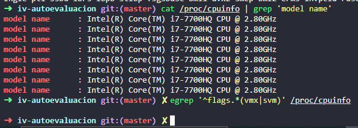

Linux virtualizado sobre Windows 10 (usando WSL2). Mi ordenador con Windows no tiene la virtualización hardware activada.

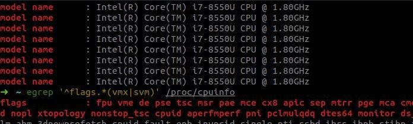

Linux nativo en un Thinkpad donde sí está activada.

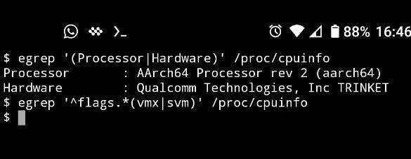

En mi móvil Android donde no está activada.

Usando la orden `LC_ALL=C | grep Virtualization` obtengo:

- En WSL2: `Virtualization type: full`
- En Linux nativo en Thinkpad: `Virtualization: VT-x`

**Ejercicio 4** Instalar un hipervisor para gestionar máquinas virtuales, que más adelante se podrá usar en pruebas y ejercicios. Usar siempre que sea posible un hipervisor que sea software libre.

Voy a aprovechar que tengo VirtualBox instalado. Es un hipervisor de tipo 2 (corre como aplicación, no _bare metal_) y además es Open Source.

[Captura](img/virtualbox.jpg) donde muestro que tengo Virtual Box instalado, dónde además salen las máquinas virtuales de SWAP y un artículo para ver como se calculan las amortizaciones del ejercicio 1 porque no sé hacerlo :D.

**Ejercicio 5:** Darse de alta en una web que permita hacer pruebas con alguno de los sistemas de gestión de nube libres como los mencionados en los párrafos anteriores, aunque sea temporalmente. Si la prueba es menos de un mes, simplemente anotarlo y dejarlo para el mes de diciembre, más o menos.

Estoy dado de alta en Digital Ocean porque lo uso para mis cosillas personales (y porque por hacer el [Hacktobeerfest](https://hacktoberfest.digitalocean.com/) te dan crédito gratis jeje).

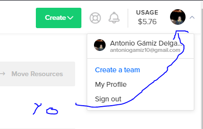

## Hito 2

Por ahora vacío.

## Hito 3

Por ahora vacío.

## Hito 4

**Ejercicio 9**: Haced los dos primeros pasos antes de pasar al tercero.

1. Darse de alta.

Primeramente nos vamos a la página de Travis y nos logeamoos (yo ya estoy registrado desde hace tiempo, así que ya tengo cuenta linkeada con GitHub):

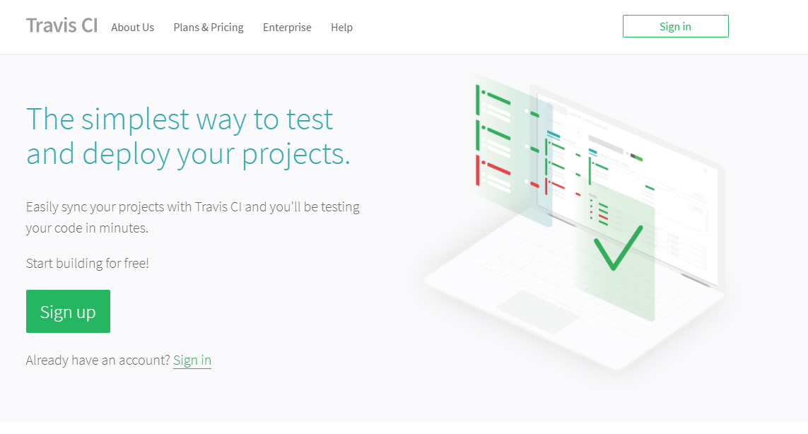

Como se aprecia en esta captura, suelo usar Travis en otros proyectos. En concreto, los que aparecen ahí son de Raku, un lenguaje de programación.

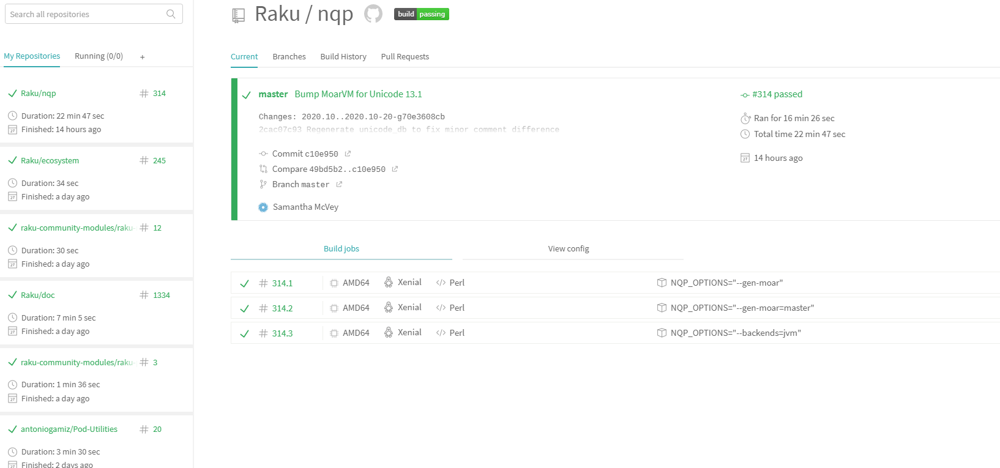

2. Activar el repositorio en el que se vaya a aplicar la integración continua:

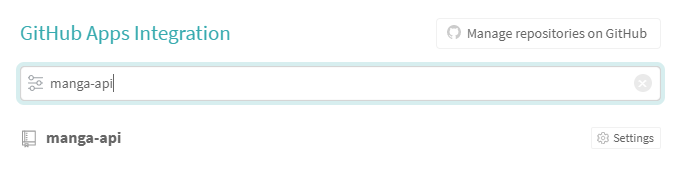

A mí ya me aparece el repositorio como añadido porque tengo Travis configurado para todos los repositorios de mi cuenta. Es decir, con crear un archivo `.travis.yml` en cualquiera de mis repositorios ya se activa una build.

**Ejercicio 10**: Configurar integración continua para nuestra aplicación usando Travis o algún otro sitio.

Para configurar Deno en Travis tenemos dos opciones:

- Instalar Deno cada vez que ejecutemos una buid y cachearlo. Lo que se puede hacer fácilmente con el siguiente archivo de configuración:

    ~~~yml
    language: sh

    install:
      - curl -fsSL https://deno.land/x/install/install.sh | sh
      - export PATH="$HOME/.deno/bin:$PATH"

    script:
      - deno --version

    cache:
      directories:
        - '$HOME/.deno'
    ~~~

- Usar el contenedor de Docker creado en el hito anterior:

    ~~~yml
        services:
          - docker

        before_install:
          - git checkout master
          - docker pull ghcr.io/antoniogamiz/manga-api

        script:
          - docker run -t -v `pwd`:/test ghcr.io/antoniogamiz/manga-api
    ~~~

Solo tenemos estas dos opciones porque Deno no es oficialmente soportado por Travis todavía.

## Hito 5

**Ejercicio 1:** Darse de alta en Vercel y Firebase, y descargarse los SDKs para poder trabajar con ellos localmente.

#### Vercel

Me doy de alta con github:

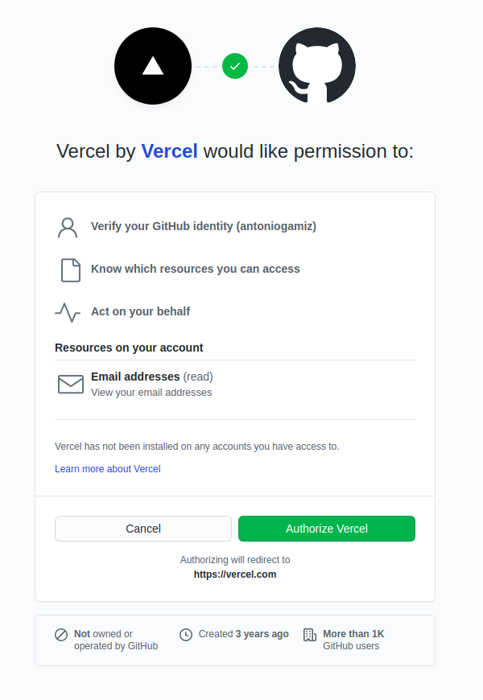

Con la orden `npm i -g vercel` nos instalamos el cliente de Vercel:

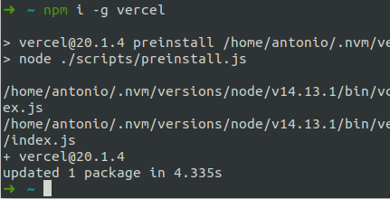

#### Firebase

En Firebase ya estaba dado de alta previamente:

Con la orden `npm install -g firebase-tools` nos instalamos el cliente de Firebase:

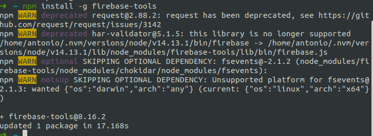

**Ejercicio 2:** Tomar alguna de las funciones de prueba de Vercel, y hacer despliegues de prueba con el mismo.

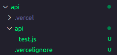

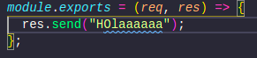

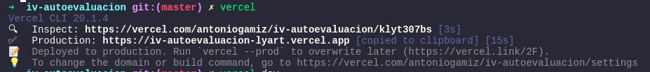

**Ejercicio 3:** Tomar alguna de las funciones de prueba de Netlify, y hacer despliegues de prueba con el mismo.

Registro:

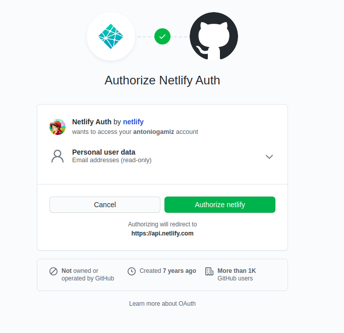

Instalación de cli:

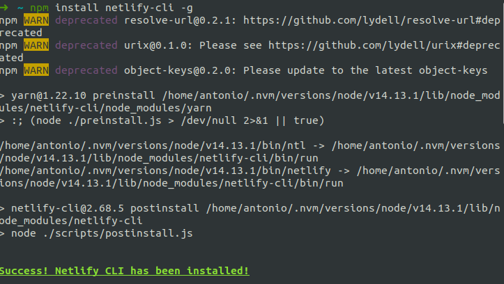

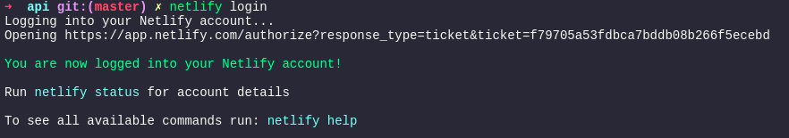

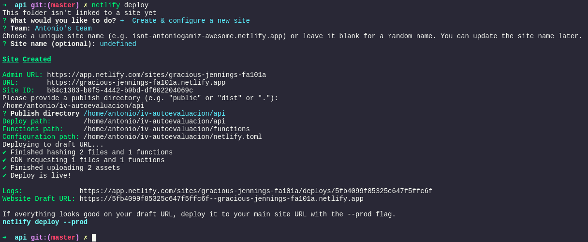

